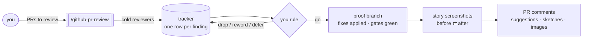

# github-pr-review

An agent skill that reviews GitHub PRs and posts the findings as inline
comments that PR authors can act on. Cold reviewers find the issues, you
rule on them, and every proposed fix is proven on a scratch branch before
anything reaches GitHub.



## Install

```bash
npx skills add frontier159/skills -s github-pr-review
```

Works in any agent that supports the [Agent Skills](https://agentskills.io)
format: Claude Code, Codex, Cursor, and others. Or copy
[`skills/github-pr-review/`](../../skills/github-pr-review) into your agent's skills directory by hand.

Needs the [`gh` CLI](https://cli.github.com), signed in. Image uploads
need a recent `gh` (`gh pr comment --attach`). Screenshots need headless
Chrome or Chromium and Python.

### Recommended companion skills

The skill checks for these at the start of a run and asks before installing
any that are missing.

| Skill | What it adds | Install |
|---|---|---|
| [`review-loop`](../review-loop) | a cold re-review of the proof branch | `npx skills add frontier159/skills -s review-loop -g` |
| [`code-review`](https://github.com/mattpocock/skills) | standards + spec axes for the cold reviewers | `npx skills add mattpocock/skills -s code-review -g` |
| [`test-audit`](https://github.com/openclaw/openclaw/tree/main/.agents/skills/test-audit) | an audit of any tests the PR adds | `npx skills add openclaw/openclaw -s test-audit -g` |
| [`stop-slop`](https://github.com/hardikpandya/stop-slop) | cleaner comment prose | `npx skills add hardikpandya/stop-slop -g` |

## Usage

```
review PRs #12 -> #15, propose comments, I'll opine before you post
add suggestions / code snippets to those comments
add the before/after screenshots to the comments with visual impact
```

## How to use

1. Name the PRs: one, or a stack base-first. The agent pins each head
   sha and works in a fresh worktree, leaving your checkout alone.
2. Read the tracker: a markdown table per PR with ID, location, severity,
   finding, proposed fix and status. Findings already raised by review
   bots are left out.
3. Rule on each row: drop it, reword it, or defer a theme into one
   consolidated comment. The tracker always shows only the latest state.
4. The agent applies every surviving fix on a local scratch branch, runs
   your gates once, and reports which fixes work as written, which work
   with a change, and which don't. UI changes get before/after story
   screenshots and a comparison page.
5. Say go. The agent posts one review per PR: self-contained fixes as
   one-click suggestions, the rest as code sketches, and before/after
   images where a fix changes what renders.

## Example

A tracker row after triage, and the comment it becomes:

```markdown
| 15 | `format.ts:51` | HARD | Limit price is min_to/from with no unit; buys and sells mean opposite things in one column | Quote per vault share with the unit via `direction`; `token.fromBase()` instead of manual decimals | posted |
```

> The limit price is `min_to / from` with no unit, so it flips meaning with
> direction: a buy shows `0.3800` (shares per USDC) and a sell shows `2.6000`
> (USDC per share) in the same column. Quote the non-vault token per vault
> share, with the unit.
>
> Sketch of the fix:
> ```ts
> const [price, unit] =
>   direction === 'buy' ? [from.div(to), fromToken.symbol] : [to.div(from), toToken.symbol];
> return `${price.toFixed(4)} ${unit}`;
> ```
>
> **Before/after** (story with this fix applied):
> - The buy row reads `2.6316 USDC` (was `0.3800`).
>
> 

## How it works

**Pin.** Records every PR's head, base and body over REST, orders a stack
base-first, opens a worktree, and runs your gates at each tip as a
baseline.

**Dedupe.** Reads every existing comment. Bot findings become a do-not-repeat
list, and human comments count as decisions.

**Review cold.** One fresh-context reviewer per PR covers standards and
over-engineering, and one more reviews the whole stack for spec, placement
and production safety. They never see each other's output.

**Triage.** The agent traces every finding in the code before you see it.
You rule; the agent rewrites the tracker.

**Prove.** One agent applies all the fixes in bulk on a scratch branch and
runs the gates once. A fix that fails is rewritten to the variant that passed.

**Capture.** Story screenshots from both trees, each pair captured back to
back so relative timestamps match, then pixel-diffed. Flakes are recaptured.
Each changed story gets a bullet naming the fix that changed it.

**Post.** Anchors every comment on a line inside the PR's diff, decides
suggestion ranges before posting, posts one review per PR, then embeds the
uploaded images.

## What makes the comments land

- **Self-contained.** Each comment states the finding, the fix and the
  evidence, so the author never needs the review transcript.
- **Proven.** Every suggestion and sketch passed the repo's gates on the
  proof branch, so "Commit suggestion" doesn't break the build.
- **Visible.** A fix that changes what renders shows it, with before/after
  images and a line saying what moved.
- **Quiet.** No repeats of what the bots said, and nothing posted that
  you didn't approve.

## Examples

- [001-stacked-review.md](examples/001-stacked-review.md): a full run on a
  five-PR UI stack, from invocation to posted reviews, including the
  triage exchange, the proof report, a flaky screenshot, and moving
  single-line comments onto ranges so they can take suggestions.

## Hard rules

- Never posts before you rule on the tracker and say go.
- Never edits the PR branches. Fixes are proven on a local scratch branch
  that is never pushed.
- Never posts a fix it hasn't proven.
- Never repeats a finding that a bot or human already raised on the PR.

