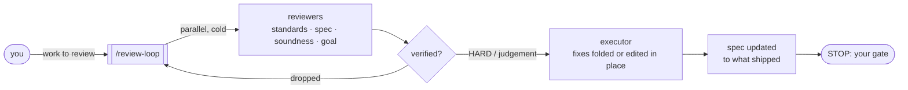

# review-loop

An agent skill that runs a cold, adversarial review loop over anything with
a spec or a standard to meet: code branches, PRs, plans, specs, design docs.
Fresh-context reviewers find the issues, the agent verifies each one, and an
executor applies the fixes. Then it stops for your go-ahead.



## Install

```bash
npx skills add frontier159/skills -s review-loop
```

Or ask your agent:

```
install the review-loop skill from https://github.com/frontier159/skills
```

Or copy [`skills/review-loop/`](../../skills/review-loop) into your agent's
skills directory by hand.

### Recommended companion skills

The skill checks for these at the start of a run and asks before installing any that are missing.

| Skill | What it adds | Install |
|---|---|---|
| [`code-review`](https://github.com/mattpocock/skills) | standards + spec axes for the reviewers | `npx skills add mattpocock/skills -s code-review -g` |
| [`test-audit`](https://github.com/openclaw/openclaw/tree/main/.agents/skills/test-audit) | an audit of tests the work adds | `npx skills add openclaw/openclaw -s test-audit -g` |
| [`stop-slop`](https://github.com/hardikpandya/stop-slop) | cleaner comments and doc edits | `npx skills add hardikpandya/stop-slop -g` |

## Usage

A single branch, before you push:

```
/review-loop self-review my branch feature-x against main before I push.
(optional) Goal: docs/feature-x-plan.md. Loop until clean, then stop.
```

A stack of branches:

```
/review-loop review my stacked branches feature-x-1 → feature-x-2 → feature-x-3
(base: main). (optional) Goal: docs/feature-x-plan.md.
Fix what you find in the commit that owns it, loop until clean (max 3),
then stop and report. Don't push.
```

A document:

```
/review-loop adversarial review of docs/spec.md: does it achieve its goal?
```

What makes a good prompt:
- **Branches and base.** Name both so it diffs the right range. For a stack,
  list the branches base first.
- **(optional) Goal:** what the work is meant to do. A plan or design doc, a
  ticket or issue link, the PR description, or a sentence or two inline all
  work. Without a goal the review still checks standards, but it can't tell
  whether the work does what it should: missing pieces, half-built items,
  scope creep.
- **How far to loop.** Without "loop until clean" it runs once and stops for
  you; see [Driving the loop](#driving-the-loop).
- **"Curate the branch for review"**, to re-carve the history into a readable
  story before you open the PR.

## Driving the loop

Every finding gets a severity from 1 (nit) to 10 (must fix). A loop is **clean** when nothing at or above the bar survives verification; the bar defaults to 3. You choose how far it runs:

| You say | It does |
|---|---|
| (nothing extra) | one loop, then stops at your gate |
| "second review loop" | one more loop on the fixed work, then stops |
| "loop until clean" | loops without stopping until clean, at most 3 loops |
| "loop until clean, max 5, bar 5" | your cap and bar |

After a loop it always reports the findings table by severity, what it declined and why, and why it stopped: clean, cap, or your gate. Later loops find less, and reviewers drift towards nits as the real issues run out, so a loop that finds only nits ends the run.

## How it works

**Pin.** Names the subject (branches with their tips and bases, or a document
and its version), the spec it answers to, and the standards: the repo's
guides plus your house rules. For code it records a baseline of build,
typecheck and tests.

**Review cold.** Launches parallel reviewers with fresh context, which never
see each other's output. Axes depend on the subject:
- **standards** and **spec** for code;
- **soundness** for documents;
- **remaining work** for plans with unbuilt phases;
- **goal** when you ask whether the whole thing gets where it's meant to.

**Verify.** Traces every finding before acting. Each one ends up HARD (a rule
or a correctness bug), judgement (fixed when small and clearly better), or
dropped with a reason. Where the spec and the rules conflict, the rules win,
and the report says so.

**Fix.** A strong-model executor follows a precise brief.
- Code: fixes fold into the commits that own them, and every commit
  typechecks alone.
- Documents: the executor edits in place and keeps a dated list of review
  revisions.

**Document.** Updates the spec to what actually shipped and lists the open
questions.

**Curate (optional).** Re-carves the history into a readable story. The final
tree stays byte-identical, and every commit stays green. Then it loops again.

**Stop.** Reports, per subject: the findings by severity, what changed and
why, what it declined to change, and the decisions left for you. Nothing is
pushed until you say go.

## Hard rules

- Reviewers are cold and read-only.
- Never acts on a finding it hasn't verified.
- Never pushes, opens a PR or starts the next phase without your go-ahead.
- Never stashes; folds fixes rather than appending fix commits.
